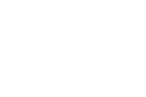

---
# ============================================
# EDIT YOUR POSTER INFO HERE
# ============================================
title: "Your Program or Initiative Title"
subtitle: "A brief tagline or framing statement"

# Author info (displayed in the author bar)
# Line 1: name and title. Line 2: affiliation and contact.
# Use <strong> for bold, &bull; for bullet separators.
author-line-1: "<strong>Your Name</strong>, Ph.D. &ensp;&mdash;&ensp; Your Title"
author-line-2: "College of Information Science &ensp;&bull;&ensp; University of Arizona &ensp;&bull;&ensp; you@arizona.edu"

# ============================================
# FORMAT: Generally don't need to change these
# ============================================
format:
  html:
    theme:
      - cosmo
      - infosci-program-poster.scss
    toc: false
    embed-resources: true
    page-layout: custom
    title-block-style: none
    section-divs: false
    include-in-header:
      text: |
        <style>
        html, body { margin: 0; padding: 0; overflow-x: auto; }
        main.content { padding: 0; margin: 0; max-width: none; }
        #quarto-content { padding: 0; }
        </style>
    include-after-body:
      text: |
        <style>
        .poster-body { display: grid !important; grid-template-columns: 1fr 1fr 1fr !important; width: 100% !important; }
        .poster-body > .column, .poster-body > div.column { flex: unset !important; width: auto !important; overflow-x: visible !important; min-width: 0 !important; }
        </style>
---

```{=html}
<div class="poster">
  <header class="poster-header">
    <div class="logo-left">
      
    </div>
    <div class="title-block">
      <h1 class="poster-title"></h1>
      <p class="poster-subtitle"></p>
    </div>
    <div class="logo-right">
      
    </div>
  </header>

  <div class="author-bar">
    <span class="authors"></span>
    <span class="authors"></span>
  </div>

  <div class="poster-body">
    <div class="column">
```

::: {.pillar-header}
::: {.pillar-title}
Column One
:::
::: {.pillar-question}
A framing statement or guiding question for this column.
:::
:::

::: {.content-card}

Replace this content with your own. The content card fills the space below the pillar header. You can use any combination of the components documented in POSTER-GUIDE.md.

- Bullet points work normally
- Use **bold** and *italic* as needed

::: {.definition-box}
<div class="def-label">What is your key concept?</div>
<div class="def-text">A brief definition or explanation that anchors this column's theme. This box is pushed to the bottom of the column automatically.</div>
:::

:::

```{=html}
    </div>
    <div class="column column-center">
```

::: {.pillar-header}
::: {.pillar-title}
Column Two
:::
::: {.pillar-question}
The central narrative or framework of your poster.
:::
:::

::: {.content-card}

This is typically the core content column. Good candidates: a diagram, a framework visualization, a process flow, or a central argument.

### A Section Header

Section headers (h3) inside content cards render as styled blue bars. Use them to divide content within a column.

- Point one about your framework
- Point two about your framework
- Point three about your framework

:::

```{=html}
    </div>
    <div class="column">
```

::: {.pillar-header}
::: {.pillar-title}
Column Three
:::
::: {.pillar-question}
Evidence, outcomes, or next steps.
:::
:::

::: {.content-card}

::: {.stat-boxes}
::: {.stat-box}
**42**

Metric A
:::

::: {.stat-box}
**8**

Metric B
:::

::: {.stat-box}
**3**

Metric C
:::
:::

Use stat boxes for quick-glance numbers. Below them, add supporting narrative, lists, or additional components.

::: {.qr-box}
::: {.qr-content}
**Learn More**

Your project website

[yoursite.arizona.edu]{.qr-url}
:::
::: {.qr-placeholder}
QR CODE
:::
:::

:::

```{=html}
    </div>
  </div>

  <footer class="poster-footer">
    <span>Left footer text</span>
    <span><strong>University of Arizona</strong> &bull; College of Information Science</span>
    <span>Right footer text</span>
  </footer>
</div>
```
